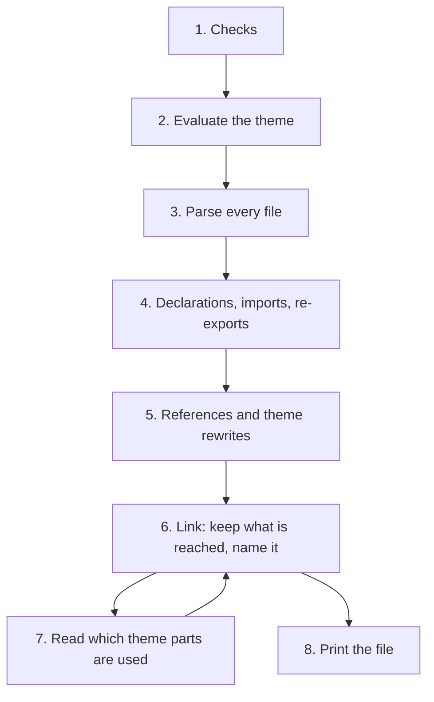

# `add --standalone`

> Read this only when you work on `--standalone`. Nothing else in the CLI depends on it.

[`standalone.ts`](../src/standalone.ts) is the hardest file in the CLI. It's 1,400 lines, and `buildStandalone` alone is about 700 of them. This page gives you a map so you can find the part you need without reading it all.

## What it produces

`axiom add separator --standalone --styling stylesheet` writes one file, `src/components/ui/separator.tsx`. Abridged:

```tsx
// Standalone separator, added by axiom with the stylesheet styling.
// No theme: the values below are Axiom's light theme, resolved when the file was added.

import { Children, cloneElement, createContext, use, ... } from "react";
import { StyleSheet, Text as NativeText, View, ... } from "react-native";

const metrics: Metrics = { touchTarget: 44, ..., hairline: StyleSheet.hairlineWidth };
const spacing: Spacing = { 0: 0, 1: 4, 2: 8, ... };
const theme = { tokens: { spacing, typography, metrics }, colors: { ... } } as const;

// slot
function Slot(...) { ... }

// theme/tokens
type Spacing = Record<0 | 1 | 2 | ..., number>;

// text
function Text(...) { const { tokens, colors } = theme; ... }

export function Separator(...) { const { tokens, colors } = theme; ... }
```

So the file contains:

- the npm imports, merged and deduplicated;
- the theme values the code reads, not the whole theme;
- every Axiom item it stands on (`slot`, `text`), inlined under a `// <item>` comment, keeping only the declarations that something reaches;
- the requested item last, unchanged except that `useTheme()` became `theme`.

To see it yourself, run the "CLI: add button" debug configuration once to create `/tmp/axiom-sandbox`, then `bun packages/cli/src/index.ts add separator --standalone --no-install --registry packages/registry --cwd /tmp/axiom-sandbox` from the repo root.

## Why it needs the TypeScript compiler

Text replacement can't do this job. To inline `text` into `separator`, the CLI needs to know what each identifier refers to: a declaration in another file, an npm import, or the theme. Two files may both declare `styles`, so one has to be renamed everywhere it's used, and nowhere else. The TypeScript type checker answers "what does this identifier point to", so `standalone.ts` builds a small in-memory program (`createProgram`) and asks it.

## The stages of `buildStandalone`

Each stage starts with a comment in the code. Search for the quoted text to jump there.



1. **Checks.** Start of the function. Refuses theme items, items marked `standalone: false` (or depending on one), a missing variant, a missing icon source.
2. **Evaluate the theme.** Search for "The theme is read from the registry". `evaluateTheme` transpiles the theme's source files and runs them with a fake `require`, to get the real light-theme object with every component's tokens. `StyleSheet.hairlineWidth` only exists on a device, so a placeholder (`HAIRLINE`) stands in for it and gets printed back as `StyleSheet.hairlineWidth`.
3. **Parse every file.** Search for "Every file the items are made of". Lists the files of every item, plus two kinds of theme files: the ones that hold types, and the helpers a styling's theme ships that import only npm packages (`cx` for tailwind). Builds the program and one `Module` per file.
4. **Declarations, imports, re-exports.** Search for "Top-level declarations.", "Imports." and "Re-exports". Records what each file declares at the top level (`Decl`), what it imports from npm (`External`), and what it imports from the theme (`ThemePart`). A name imported from the theme that a helper file declares (`cx`) isn't a theme value: it points to that declaration and is inlined under a `// theme/cx` comment, like any other.
5. **References and theme rewrites.** Search for "References, and the rewrites". The biggest block. It walks every statement, links each identifier to its target with the type checker, and records `Edit`s. The theme is read in three ways (`useTheme()`, the `theme` parameter Unistyles passes to `StyleSheet.create`, `useUnistyles()`), and each becomes a reference to one `theme` constant. A token group like `tokens.spacing` becomes a `Slice` so it can be printed as its own typed constant.
6. **Link.** Search for "const link =". Starts from the requested item and from statements with side effects, follows dependencies, and drops everything unreached. Then it picks final names: the requested item's first, then the theme, then the rest. Clashes get a prefix (`textStyles`).
7. **Theme usage.** Search for "Linked once to find". The first link shows which theme parts the code reads. `themeUsage` parses that output again to find exact paths (`colors.border`, `tokens.spacing`). A second link runs with only the slices needed.
8. **Print.** Search for "The resolved theme.". Writes the header, imports (`printImports`), theme constants (`printValue`), then each module's kept statements with its edits applied (`render`), in dependency order (`order`).

The helpers after `buildStandalone` are grouped under three banner comments: `Theme`, `Output`, `Syntax helpers`.

## Where to start when something breaks

| Symptom | Look at |
| --- | --- |
| "isn't available standalone" for an item that should be | Its `standalone` field in `registry.json`, and its internal dependencies. Stage 1. |
| "standalone mode can't evaluate …" | A theme file imports something `evaluateTheme`'s fake `require` doesn't handle. Stage 2. |
| A theme value missing or `undefined` in the output | `themeUsage` and the slices. Stages 5 and 7. |
| A name clash or a reference to a dropped declaration | `link` and its `allocate`. Stage 6. |
| Broken syntax in the output | The `Edit` that produced it (stage 5), and `render`. |

The `add --standalone` tests in [`cli.test.ts`](../test/cli.test.ts) check that the output imports only npm packages, and that NativeWind and Uniwind each get a self-contained file. `bun scripts/standalone.ts` in `packages/registry` builds every item for every variant so `bun run typecheck` compiles them. For a change here, also open the generated file and read it.
